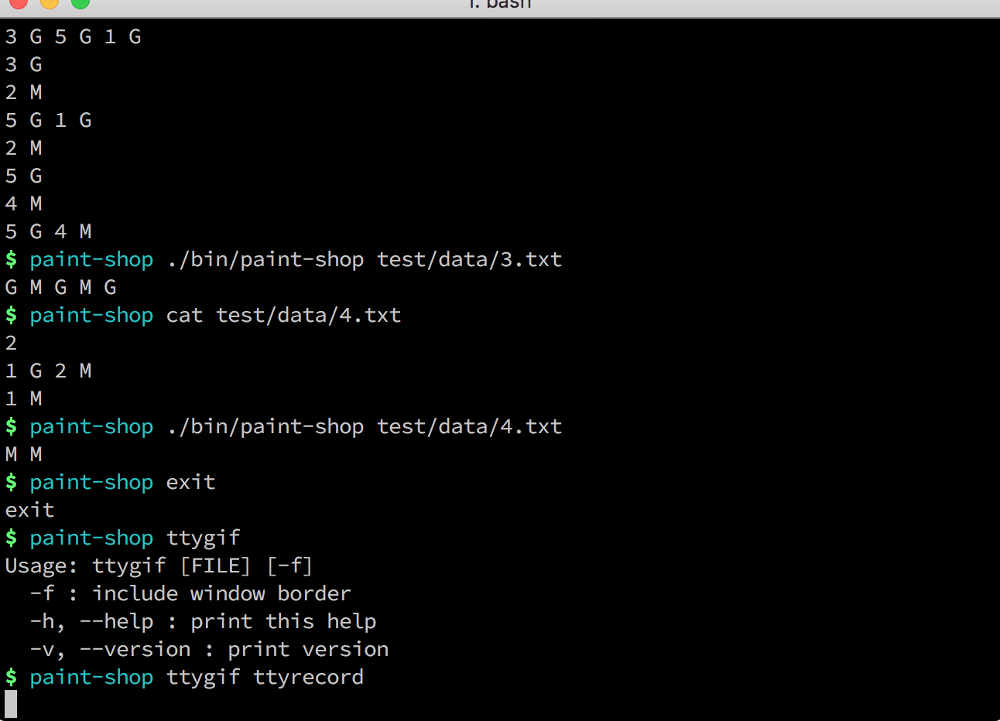

## Paint shop coding exercise
This is a solution for [this](doc/problem.md) problem.


### Installation and usage
Solution was implemented in Ruby language. You need to have a Ruby interpreter installed.

Clone this repository and run:

```
./bin/paint-shop
```

Program ships with a command line single executable called `paint-shop`. You could download it from here:
```
wget -O /usr/local/bin/paint-shop https://github.com/tradziej/paint-shop/releases/download/0.0.1/paint-shop-x86_64-linux
```
or here:
```
wget -O /usr/local/bin/paint-shop https://github.com/tradziej/paint-shop/releases/download/0.0.1/paint-shop-x86_64-apple-darwin
```
depending on your platform.

Give it permissions to execute:
```
chmod +x /usr/local/bin/paint-shop
```



### Testing
You need to have [bundler](https://bundler.io/) installed.

```
gem install bundler
```

To run all tests:
```
./bin/test
```

### Solution
Paint shop problem is a example of [boolean satisfiability problem](https://en.wikipedia.org/wiki/Boolean_satisfiability_problem).

For given example:
```
5
1 M 3 G 5 G
2 G 3 M 4 G
5 M
```

We could represent every paint as `x1, x2, x3, ..., xn` where `n` is a paint number.
If `xn = 1` it means that `n` paint is "gloss" and if `xn = 0` it is "matte" finish.

So every customer preferences could be written as a set of clauses:
`(not(x1), x3, x5)`, `(x2, not(x3), x4)`, `(not(x5))`

Customer is satisfied if at least one paint from his preferences is providen. It could be represented as boolean equation, eg. for first customer it is: `(not(x1) or x3 or x5) = 1`.

To satisfy all customers we need to find a solution for logical `and` operation.

To solve given example we need to find a solution for a boolean formula:
`(not(x1) or x3 or x5) and (x2 or not(x3) or x4) and (not(x5)) = 1`

I have implemented two solutions:
* **Naive** solver which generate all possible solutions, iterate over them and select solutions that satisfying all customers. Chosen solutions are sorted and the best one is returned.
* **Backtracking** method.